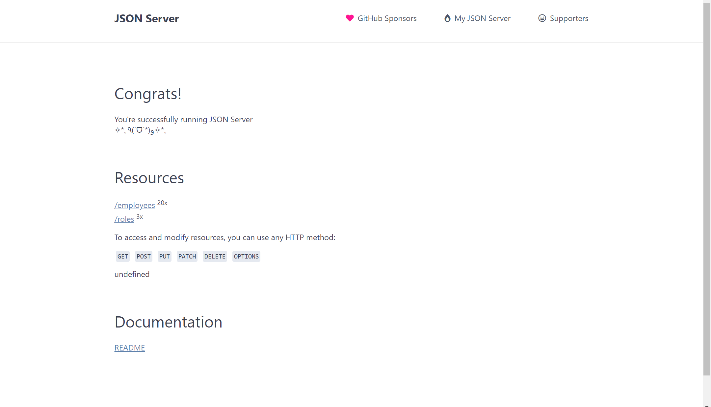

## Create Fake Rest Api



```JSON
"employess": [
    {
        "id": 1,
        "first_name": "Nickolaus",
        "last_name": "Ogers",
        "email": "nogers0@blog.com",
        "gender": "Male",
        "roleId": 3
    }
]
```

<br>

```JSON
  "roles": [
    {
      "id": 1,
      "name": "Manager"
    },
    {
      "id": 2,
      "name": "Engineer"
    },
    {
      "id": 3,
      "name": "Intern"
    }
  ]
```

<br>

# Routes

```
GET    /roleId
GET    /employees
GET    /employees/1
POST   /employees
PUT    /employees/1
PATCH  /employees/1
DELETE /employees/1
```

<br>

## Filter

```
# Filter by Id
GET /employees?id=[Id]

# Filter by First Name
GET /employees?first_name=[First Name]

# Filter by Last Name
GET /employees?last_name=[Last Name]

# Filter by Email
GET /employees?email=[Email]

# Filter by Gender
GET /employees?gender=[Gender]

# Filter by Role Id
GET /employees?roleId=[Role Id]
```

<br>

## Paginate

<br>

### Use _page and optionally _limit to paginate returned data

<br>

```
GET /employees?_page=7
GET /employees?_page=7&_limit=20
```

<br>

## Sort

<br>

### Add _sort and _order (ascending order by default)

<br>

```
GET /employees?_sort=first_name&_order=asc
GET /employees/1/comments?_sort=roleId&_order=asc
```

<br>

## Relationships

<br>

### To include children resources, add _embed

<br>

```
GET /roleId?_embed=employees
```

<br>

### To include parent resource, add _expand

<br>

```
GET /employees?_expand=role
```